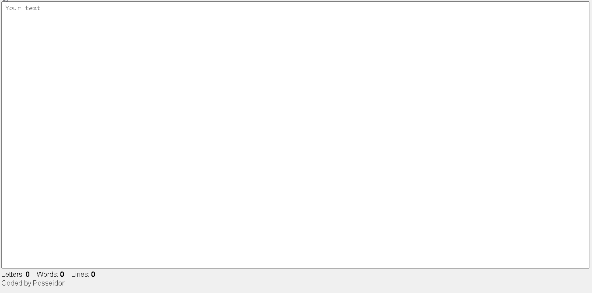

# N Words count
Count the words and letters of your text.



## How to run the project

1. Clone this repo
2. ``` cd n-words ```
3. ``` npm install ```
4. ``` npm run serve ```


### Compiles and minifies for production
```
npm run build
```

### Lints and fixes files
```
npm run lint
```